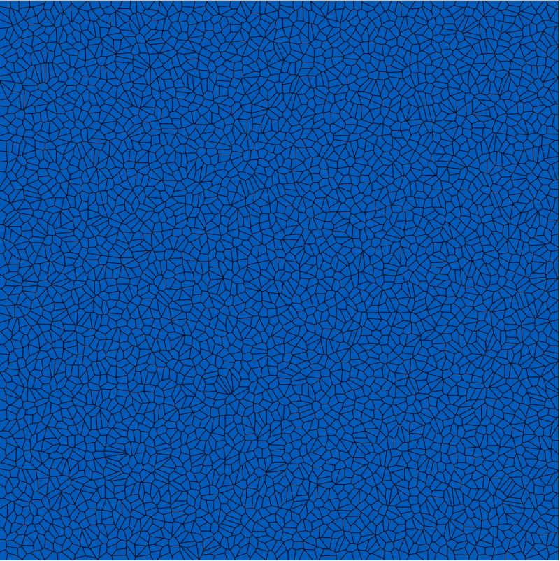

# semi_discrete_ot_2d
Semi-discrete optimal transport code to compute the uniformity of a 2D point set

Sample self-explanatory code in main.cpp. To integrate in your projects, add transport.h and transport.cpp. No external dependencies.

