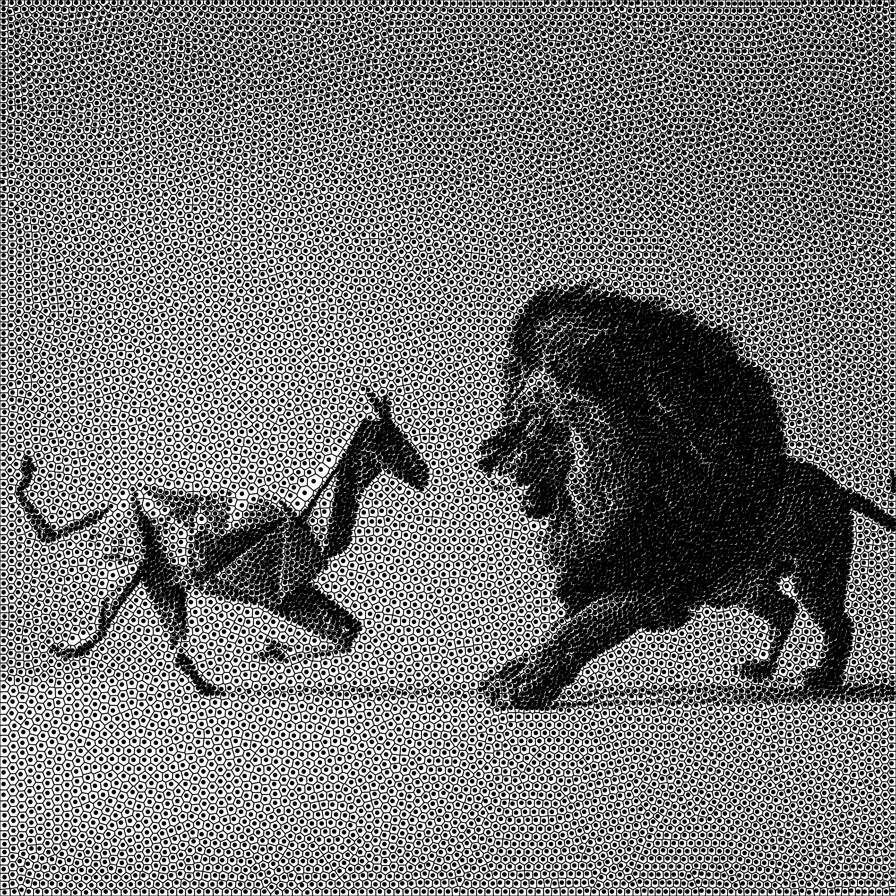

# semi_discrete_ot_2d
Semi-discrete optimal transport code to compute the uniformity of a 2D point set, as well as for the semi-discrete optimal transport problem of non-uniform densities (in progress).

Sample self-explanatory code in main.cpp. To integrate in your projects, add transport.h and transport.cpp. No external dependencies.

For Mac users: 
```
brew install libomp 
c++ -std=c++11 -O3 -o main main.cpp transport.cpp -lomp -L/opt/homebrew/opt/libomp/lib -I/opt/homebrew/opt/libomp/include  -Xpreprocessor -fopenmp
```

You may need to increase the stack size (e.g., if it crashes due to a stack overflow upon starting).


Lloyd for non-uniform density is still very slow (here 9min for 16k samples) due to rasterization/integration:

 


